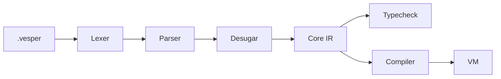

# Architecture

## Pipeline

## Compiler Phases

1. **Lexer & Parser** (`lib/lexer.mll`, `lib/parser.mly`, `lib/parse_facade.ml`):
   `ocamllex` and Menhir LALR(1) parser. Attaches source spans (`Ast.span`) to all nodes. Lossless pretty-printer in `lib/printer.ml`.
2. **Diagnostics** (`lib/diagnostic.ml`, `lib/error_code.ml`):
   Total error isolation (Law 1). No host OCaml exceptions leak on malformed input.
3. **Core IR & Desugaring** (`lib/core_ir.ml`, `lib/desugar.ml`, `lib/normalize.ml`):
   Preserves span lineage (Law 3). Idempotent AST-to-Core lowering (Law 4).
4. **Reference Evaluator** (`lib/eval.ml`, `lib/env.ml`):
   Pure tree-walking evaluator bounded by step/fuel counts (Law 5).
5. **Typechecker** (`lib/types.ml`, `lib/typecheck.ml`, `lib/unify.ml`):
   Bidirectional Hindley-Milner type inference (Algorithm W).
6. **Pattern Matching** (`lib/pattern.ml`, `lib/exhaustiveness.ml`, `lib/pat_compile.ml`):
   Maranget pattern matrix algorithm, exhaustiveness checks, and decision trees.
7. **Modules** (`lib/mod_ast.ml`, `lib/namespace.ml`, `lib/dep_graph.ml`):
   Namespaces, interface checking, and topological cycle detection.
8. **Bytecode VM** (`lib/opcode.ml`, `lib/bytecode.ml`, `lib/compiler.ml`, `lib/vm.ml`):
   Stack machine with compact bytecode instructions and disassembler (`lib/disasm.ml`).
9. **Standard Library & Effects** (`lib/effect_runtime.ml`, `lib/stdlib/`):
   Sandboxed runtime boundaries and pure data structures (`List`, `Map`, `Option`, `Result`, `String`, `Math`).
10. **CLI & Tooling** (`lib/cli.ml`, `lib/repl.ml`, `lib/lsp_server.ml`):
    Subcommand driver, interactive REPL, and JSON-RPC LSP server.

## Law Verification

| Law | Invariant | Verified By |
| :--- | :--- | :--- |
| **Law 1** | Total Diagnosability | `tests/laws/test_law1_diagnosability.ml` |
| **Law 2** | Invertible Syntax | `tests/laws/test_law2_roundtrip.ml` |
| **Law 3** | Source Provenance | `tests/laws/test_law3_provenance.ml` |
| **Law 4** | Idempotent Normalization | `tests/laws/test_law4_idempotence.ml` |
| **Law 5** | Deterministic Evaluation | `tests/laws/test_law5_determinism.ml` |
