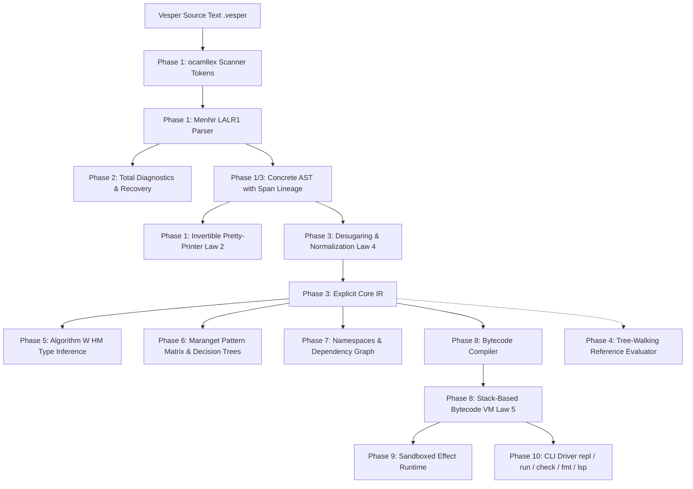

# Vesper Compiler & Runtime Architecture

This document details the end-to-end architecture of **Vesper**, covering all ten compiler phases from lexical scanning down to bytecode execution and developer tooling.

---

## 1. High-Level Architecture Overview

---

## 2. Compilation Phases

### Phase 1: Lexical Analysis, Parsing & Invertible Pretty-Printing
* **Lexer (`lib/lexer.mll`)**: Fast, zero-overhead lexer generated with `ocamllex`. Tracks line numbers and column offsets across every token.
* **Tokens (`lib/tokens.mli`)**: Strongly typed token representation including keywords (`let`, `in`, `if`, `then`, `else`, `fun`, `rec`), literals, identifiers, and symbols.
* **Parser (`lib/parser.mly`)**: LALR(1) grammar parsed with Menhir. Generates zero shift/reduce and zero reduce/reduce conflicts. Attaches an exact `Ast.span` coordinate to every AST node.
* **Pretty-Printer (`lib/printer.ml`)**: Lossless AST serializer respecting operator precedence and indentation. Verifies **Law 2**: $\text{parse}(\text{print}(A)) \equiv A$.

### Phase 2: Diagnostics & Host Isolation (Law 1)
* **Modules**: `lib/diagnostic.ml`, `lib/error_code.ml`, `lib/parser_messages.ml`.
* **Host Isolation Guarantee**: Under no circumstance does malformed user input or syntax error trigger an unhandled OCaml host exception (`assert false`, `Failure`, `Match_failure`).
* **Rich Diagnostic Reports**: Every parse, type, and evaluation error carries an error code (`E1001`, `E2001`, etc.), file path, line/column span, and informative diagnostic snippet.

### Phase 3: Core Intermediate Representation (Core IR) & Normalization
* **Modules**: `lib/core_ir.ml`, `lib/desugar.ml`, `lib/normalize.ml`.
* **Strict Source Provenance (Law 3)**: Desugaring preserves 100% of source spans from the concrete AST to the Core IR nodes.
* **Idempotent Lowering (Law 4)**: The desugaring and normalization pass is mathematically idempotent: $\text{desugar}(\text{desugar}(E)) \equiv \text{desugar}(E)$.

### Phase 4: Deterministic Reference Evaluator & Fuel Bounds
* **Modules**: `lib/eval.ml`, `lib/env.ml`, `lib/value.ml`.
* **Value Model**: Pure immutable value representations (`VInt`, `VBool`, `VString`, `VClosure`).
* **Fuel Bounds**: Every evaluation step consumes execution fuel. Infinite loops or recursive spirals terminate deterministically with a bounded out-of-fuel diagnostic, preventing host thread deadlocks (Law 5).

### Phase 5: Static Analysis & Hindley-Milner Type Inference
* **Modules**: `lib/types.ml`, `lib/type_env.ml`, `lib/unify.ml`, `lib/typecheck.ml`.
* **Algorithm W**: Bidirectional type checking and Hindley-Milner parametric polymorphism.
* **Strict Total Soundness**: Types are fully inferred and unified before bytecode emission. Any type mismatch stops compilation with pinpoint error coordinates.

### Phase 6: Algebraic Data Types & Exhaustive Pattern Matching
* **Modules**: `lib/pattern.ml`, `lib/exhaustiveness.ml`, `lib/pat_compile.ml`.
* **Matrix Algorithm**: Implements Luc Maranget's pattern-matching matrix algorithm.
* **Exhaustiveness & Redundancy Checking**: Detects missing cases and dead / unreachable branches at compile time.
* **Decision Trees**: Compiles nested patterns into optimal decision trees without exponential code explosion.

### Phase 7: Module System & Compilation Units
* **Modules**: `lib/mod_ast.ml`, `lib/namespace.ml`, `lib/dep_graph.ml`, `lib/module_check.ml`.
* **Features**:
  * Hierarchical namespaces and signature interfaces (`.mli`-style boundary checking).
  * Topological sorting of compilation units.
  * Cycle detection preventing circular module dependencies.

### Phase 8: Bytecode Virtual Machine & Instruction Set Architecture
* **Modules**: `lib/opcode.ml`, `lib/bytecode.ml`, `lib/compiler.ml`, `lib/disasm.ml`, `lib/vm.ml`.
* **Stack Machine**: Compact stack-based bytecode virtual machine.
* **Instruction Set Architecture (ISA)**:
  * `CONST <idx>`: Push constant from constant pool.
  * `LOAD <idx>`, `STORE <idx>`: Local variable access.
  * `ADD`, `SUB`, `MUL`, `DIV`, `MOD`: Arithmetic opcodes.
  * `EQ`, `LT`, `LE`: Comparison opcodes.
  * `JUMP <offset>`, `JUMP_IF_FALSE <offset>`: Branching instructions.
  * `CALL <nargs>`, `RET`: Function call and return.
  * `HALT`: Clean termination.
* **Disassembler**: `lib/disasm.ml` disassembles bytecode programs with source-line annotations.

### Phase 9: Standard Library & Sandboxed Effect Runtime
* **Modules**: `lib/effect_runtime.ml`, `lib/stdlib/`.
* **Capabilities Boundary**: Host I/O and side effects are quarantined behind a sandboxed runtime interface. Malicious path traversals and unauthorized host actions are blocked.
* **Stdlib Implementations**: Pure functional implementations of `List`, `Map`, `Option`, `Result`, `String`, and `Math`.

### Phase 10: Tooling Ecosystem & Developer Experience
* **Modules**: `lib/cli.ml`, `lib/repl.ml`, `lib/lsp_server.ml`, `lib/json.ml`, `bin/main.ml`.
* **CLI Subcommands**:
  * `vesper run <file>`: Parse, typecheck, compile, execute.
  * `vesper check <file>`: Validation and diagnostic reporting.
  * `vesper fmt [--write] <file>`: Lossless canonical pretty-printing.
  * `vesper disasm <file>`: Bytecode disassembly display.
  * `vesper repl`: Interactive session with persistent evaluation environment.
  * `vesper lsp`: Language Server Protocol communicating over stdio JSON-RPC.

---

## 3. Formal Invariant Verification

| Law | Statement | Verification Mechanism |
| :--- | :--- | :--- |
| **Law 1** | Total Diagnosability & Host Isolation | `tests/laws/test_law1_diagnosability.ml`: Fuzzing with corrupt tokens never raises unhandled exceptions. |
| **Law 2** | Invertible Syntax ($\text{parse} \circ \text{print} \circ \text{parse} = \text{parse}$) | `tests/laws/test_law2_roundtrip.ml`: Property roundtrip over 1,000 generated programs. |
| **Law 3** | Strict Source Provenance | `tests/laws/test_law3_provenance.ml`: Span retention across desugaring and Core IR. |
| **Law 4** | Idempotent Normalization ($\text{desugar}^2 = \text{desugar}$) | `tests/laws/test_law4_idempotence.ml`: Multi-pass desugaring stability checks. |
| **Law 5** | Deterministic Evaluation & Sound Termination | `tests/laws/test_law5_determinism.ml`: Multi-run repeatability, fuel bounding, VM vs interpreter equivalence. |
